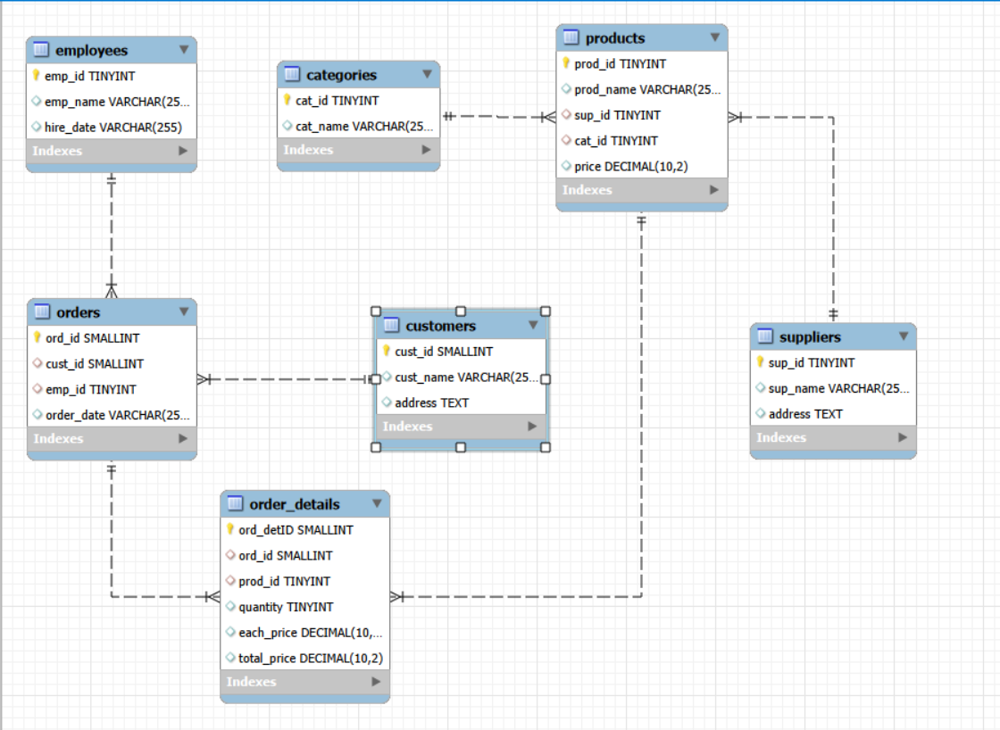

# 🛒 Grocery Store Management – MySQL Project

A complete end-to-end **SQL solution** for managing and analyzing grocery store data.  
This project demonstrates **database design, data loading, cleaning, transformations, and analytical queries** to generate meaningful business insights.

---

## 📁 Project File
| File | Description |
|------|-------------|
| `Grocery_Store_Managemet_SQL_Project.sql` | Contains schema creation, foreign keys, CSV import commands, and all analysis queries |

---

## 🛠️ Technologies Used
- **MySQL**
- **SQL Joins, Subqueries, Aggregations**
- **Data Modeling & ER Diagram Concepts**
- **CSV Data Loading (`LOAD DATA INFILE`)**

---

## 📦 Features Included

### ✔️ Database Design
- 7 interconnected tables:
  - `supplier`
  - `categories`
  - `employees`
  - `customers`
  - `products`
  - `orders`
  - `order_details`
- Auto-increment primary keys  
- Foreign key relationships  
- Cascading rules  
- Index optimization  

### ✔️ Data Loading
- Used `LOAD DATA LOCAL INFILE` to import:
  - `Suppliers.csv`
  - `Categories.csv`
  - `Employees.csv`
  - `Customers.csv`
  - `Products.csv`
  - `Orders.csv`
  - `OrderDetails.csv`

### ✔️ Analysis Queries
- **Customer Insights**
  - Top customers
  - Purchase trends
  - Average & total spending
- **Product Performance**
  - Best-selling products
  - Category-wise price & quantity trends
  - Product revenue analysis
- **Sales Trends**
  - Monthly revenue patterns
  - Daily order counts
  - Order value distribution
- **Supplier Contribution**
  - Top suppliers
  - Supplier revenue impact
- **Employee Performance**
  - Orders handled
  - Sales processed
- **Order Details**
  - Quantity vs total price correlation
  - Unit price variation

---

## 🧩 ER Diagram

### Entity Relationships
- A supplier can supply multiple products  
- Each category contains multiple products  
- A customer can place multiple orders  
- An employee can process multiple orders  
- Each order consists of multiple order detail records  
- A product can appear in multiple order detail records  

---

## 🚀 How to Run the Project
1. Create a MySQL database  
2. Open the SQL file:  
   `Grocery_Store_Management_SQL_Project.sql`  
3. Run the entire script in MySQL Workbench 
4. Ensure LOCAL INFILE is enabled before loading CSVs  
5. Run analysis queries to explore insights
